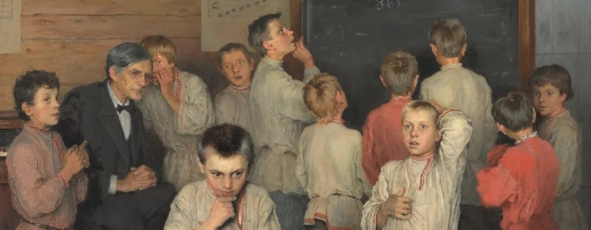
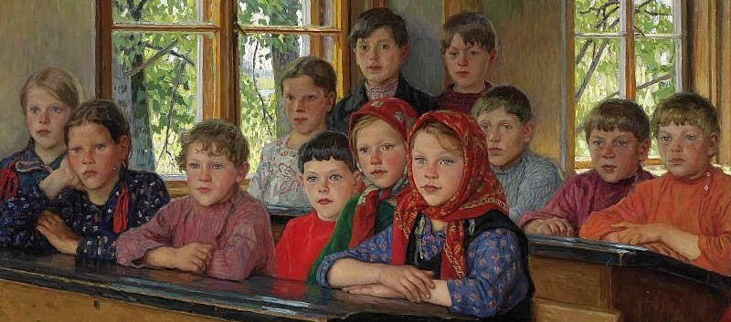

# Y cuando os hiervan los sesos, avisad 

M.— ¿Recuerda usted, señor Rodríguez, lo que dijimos de las intuiciones y de los conceptos?

R.— Que son vacíos los conceptos sin intuiciones y ciegas las intuiciones sin los conceptos. Es decir, que no hay manera de llenar un concepto sin la intuición, ni de poner ojos a la intuición sin encajarla en el concepto. Pero unidas las intuiciones y los conceptos tenemos el conocimiento: una oquedad llena que es, al mismo tiempo, una ceguedad vidente.

M.— ¿Y usted ve claro eso que dice?

R.— Con una claridad perfectamente tenebrosa, querido maestro.

 

Ver [aqui](horario.md)

- 📠[Introducción al análisis matemático](iam.md) 

- 📠[Análisis funcional en espacios de Hilbert](afeh.md) 

- 📠[Integración de funciones de una variable real](if1vr.md) 

- 📠[Series funcionales e integración de Riemann en varias variables reales](sfirvvr.md) 

(Proverbios y consejos de Mairena.)

Pláceme poneros un poco en guardia contra mí mismo. De buena fe os digo cuanto me parece que puede ser más fecundo en vuestras almas, juzgando por aquello que, a mi parecer, fue más fecundo en la mía. Pero ésta es una norma expuesta a múltiples yerros. Si la empleo es por no haber encontrado otra mejor. Yo os pido un poco de amistad y ese mínimo respeto que hace posible la convivencia entre personas durante algunas horas. Pero no me toméis demasiado en serio. Pensad que no siempre estoy yo seguro de lo que os digo, y que, aunque pretenda educaros, no creo que mi educación esté mucho más avanzada que la vuestra.

No es fácil que pueda yo enseñaros a hablar, ni a escribir, ni a pensar correctamente, porque yo soy la incorrección misma, un alma siempre en borrador, llena de tachones, de vacilaciones y de arrepentimientos. Llevo conmigo un diablo —no el demonio de Sócrates—, sino un diablejo que me tacha a veces lo que escribo, para escribir encima lo contrario de lo tachado; que a veces habla por mi y otras yo por él, cuando no hablamos los dos a la par, para decir en coro cosas distintas. ¡Un verdadero lío! Para los tiempos que vienen, no soy yo el maestro que debéis elegir, porque de mí sólo aprenderéis lo que tal vez os convenga ignorar toda la vida: a desconfiar de vosotros mismos.

   

<em>Juan de Mairena</em>

 

