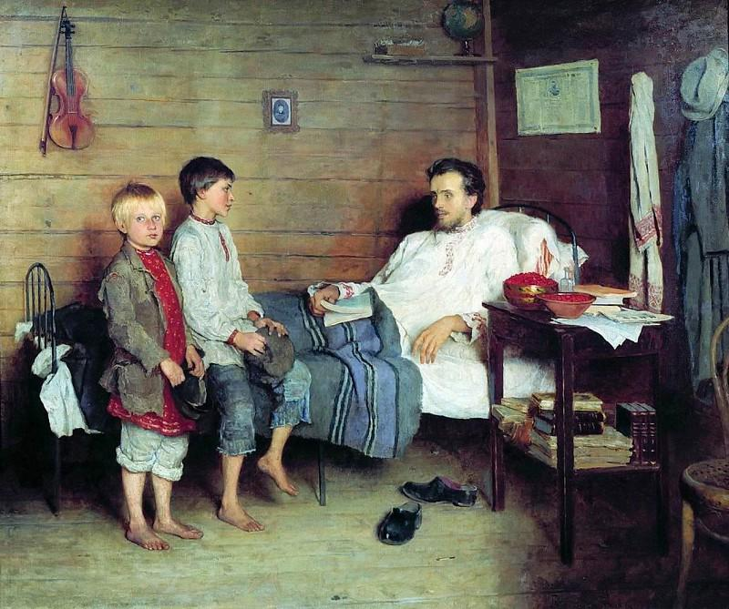

# Matemáticas para profesorado de secundaria 

Según las [_Bases para la elaboración de un currículo de Matemáticas en Educación no Universitaria_](https://matematicas.uclm.es/cemat/wp-content/uploads/bases2021.pdf) redactadas en mayo de 2021 por el Comité Español de Matemáticas (CEMat):

_"En Bachillerato todo el alumnado debería: Valorar que la probabilidad no es una propiedad objetiva de los sucesos, sino la percepción o grado de creencia en la verosimilitud de la persona que asigna la probabilidad sobre la plausibilidad de ocurrencia de un suceso"._

Ante esta situación, decidimos centrar nuestra atención en primaria y secundaria. Además...

_El hecho de que sea posible enseñar combinatoria a niños de pocos años no es razón suficiente para emprender tal iniciación. La verdadera razón reside en el hecho de que tal aprendizaje conduce al niño al corazón mismo de las matemáticas._

-  📎 [Combinatoria](combinatoria.pdf) 
-  📎 [Triángulo de Pascal I](triangulo_de_pascal.pdf) 

_El hecho de que se puedan enseñar probabilidades a los niños no es en sí razón suficiente para hacerlo. La razón principal para introducirles cuanto antes en esta rama de las matemáticas es que difiere fundamentalmente de las demás, y si obligamos a estas ideas a permanecer demasiado tiempo implícitas, los niños tendrán una idea estrecha y deformada del conjunto de la matemática, de su potencia y de sus posibilidades._

(En demolición)
